# A Cross-Platform Web Runtime Is A Product Boundary

Web apps usually start with a simple assumption: the browser is the platform.

That works for a while. Then the same product needs to run in more than one browser, inside an embedded third-party surface, in a desktop shell, in mobile webviews, or across a few generations of browser support.

At that point, "the browser" is not one platform anymore. It is a family of runtimes with different APIs, storage behavior, networking rules, telemetry paths, and localization support.

The mistake is letting every feature handle those differences on its own.

## Application Anatomy

Most web apps end up with layers, even if nobody names them at first.

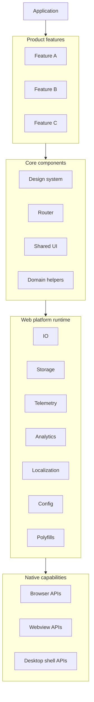

The application owns product composition. Product features own user workflows. Core components own reusable product building blocks.

The web platform runtime owns the messy part: making the same capability behave consistently across the environments where the product runs.

That layer is easy to underinvest in because it rarely ships a feature by itself. When it is missing, though, the cost shows up everywhere else.

## Code Sharing Needs Rules

Sharing everything sounds efficient. In practice, it often produces abandoned utilities, ambiguous ownership, and packages nobody wants to delete.

Sharing nothing is not better. It creates duplicated tracking code, duplicated storage helpers, duplicated fetch wrappers, duplicated polyfill decisions, and a different failure mode in every feature.

The useful middle is to decide which layers are meant to be shared.

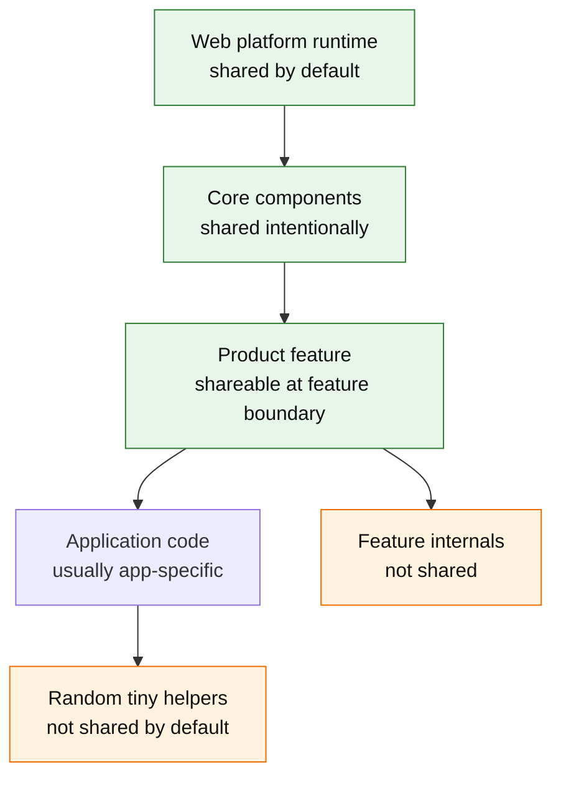

The rule I like is: share platform, core components, and deliberate product features. Do not share random internal components just because two places happen to want them today.

That rule needs enforcement. Import boundaries, package visibility, lint rules, ownership, and dependency checks matter because "please be thoughtful" does not scale.

## What The Runtime Owns

A web platform runtime is not a `utils` package. It owns the stuff every serious feature eventually needs.

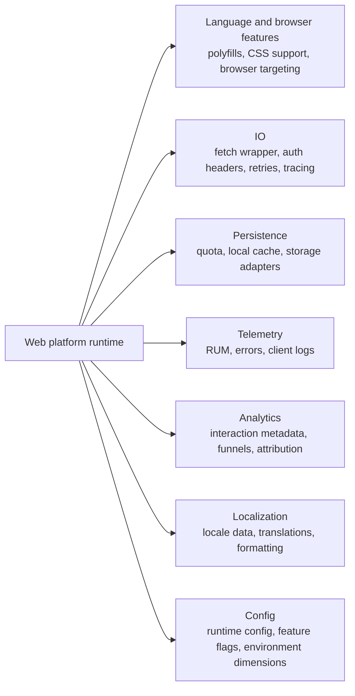

Each box looks boring until it is implemented five different ways.

## Polyfills Are A Delivery System

Polyfills are not just a list of imports at the top of the app.

Different browsers need different polyfills. Different locales need different data. Mobile Safari has different gaps from Chromium. Embedded runtimes and desktop shells may support some native APIs but not others. Localization data can be especially large because it often pulls from Unicode CLDR data.

A platform layer should decide:

- which browser and runtime versions are supported
- which APIs can be polyfilled
- which APIs must be banned or guarded
- which locale data is loaded for which user
- how polyfill bundles are tested

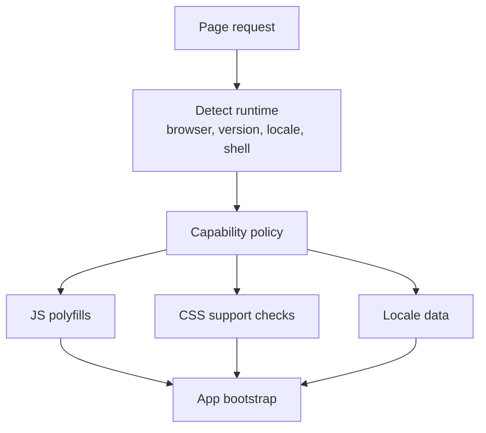

The important bit is that each feature should not make this up on the fly. Features should write against a known platform contract.

There is useful prior art here. Dropbox has historically shipped targeted bootstrap bundles for different browser/locale combinations. Yahoo-style dynamic polyfill services are another version of the same idea: do not make every client pay for every compatibility layer. Resolve the runtime shape, then send the smallest safe set of patches.

## IO Should Be A Platform API

Network code is one of the first places where cross-platform assumptions break.

The browser has `fetch`. An embedded third-party surface may need an iframe bridge. A desktop shell may have a native transport. A mobile webview may need special headers or tracing. Some environments have stricter CORS behavior. Some need request correlation with native logs.

If every feature wraps `fetch` directly, there is no single place to handle this.

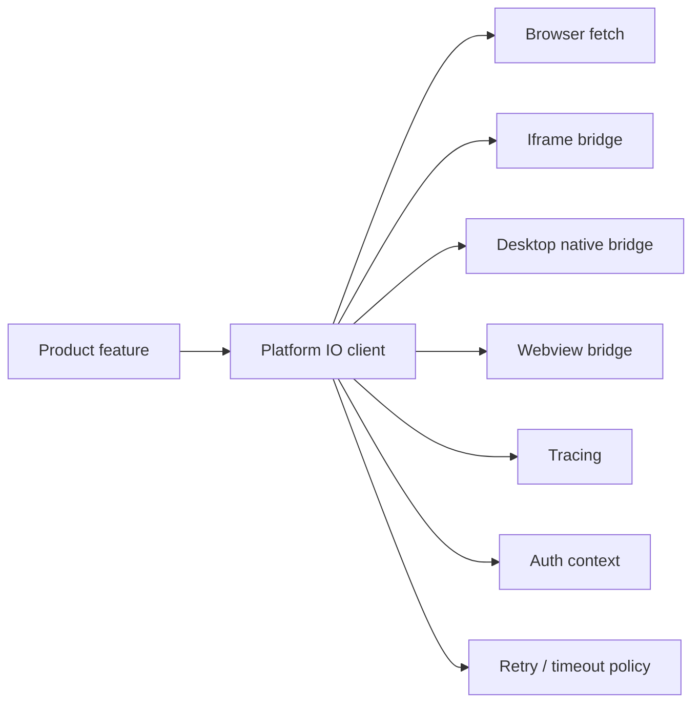

The platform IO client does not need to hide every detail. It does need to centralize the defaults people otherwise forget: tracing, auth propagation, request metadata, retries, timeouts, and runtime-specific transports.

## Persistence Is Shared Whether You Like It Or Not

Browser storage is not infinite, not uniform, and not truly feature-local.

`localStorage`, IndexedDB, Cache Storage, cookies, and memory caches all have runtime-specific behavior. Private browsing modes can restrict storage. Webviews can behave differently from browsers. Multiple product features can starve each other if each one assumes storage is free.

That makes persistence something the platform has to own.

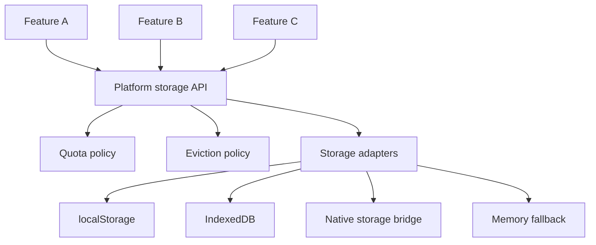

The platform should provide a storage API, decide what is cacheable, monitor usage, and make fallback behavior explicit.

## Telemetry And Analytics Are Different

Telemetry answers: is the application healthy?

Analytics answers: what did the user do?

They often share transport and metadata, but they are not the same system.

Telemetry needs page load metrics, interaction latency, client errors, logs, app version, browser version, route, device class, and deploy correlation.

Analytics needs product events, interaction hierarchy, attribution, experiment dimensions, and funnel metadata.

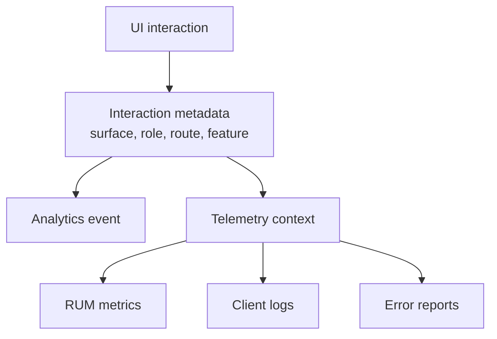

A good platform layer makes the common case automatic. A button from the design system can carry semantic metadata. A route can provide page context. A logging client can attach app version and browser dimensions without every callsite remembering to do it.

This is also where older web platform work is still relevant. Dropbox invested heavily in real-user metrics because frontend performance work needs cohorts: browser, device class, route, deploy version, and network shape. Yahoo's instrumentation systems had a similar lesson from a different angle: user behavior is only useful when events carry enough context to explain where they came from.

In other words, telemetry and analytics should not be a thousand hand-written event calls. The platform should make the boring metadata automatic.

## Localization Is Runtime Work Too

Localization is not only a translation pipeline.

The runtime also needs locale data, number/date formatting, pluralization rules, message loading, fallback behavior, and the ability to avoid shipping every locale to every user.

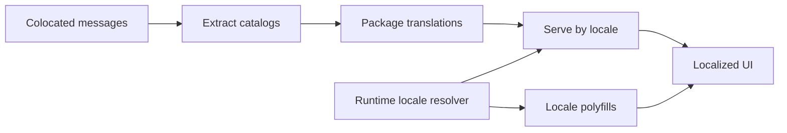

The feature should own the words. The platform should own extraction, packaging, loading, and runtime guarantees.

Again, the interesting prior art is not the specific company implementation. It is the pattern. Large web properties do not ship one giant locale payload to everyone. They extract messages, package locale data, and load the right pieces for the user and runtime.

## Config Needs A Real Shape

Every platform grows configuration.

The problem is not config existing. The problem is each feature inventing its own way to resolve it.

A platform config layer should define:

- the dimensions config can vary by
- where config is loaded from
- what is available at build time vs runtime
- how defaults work
- how missing or malformed config fails
- how config usage is tested

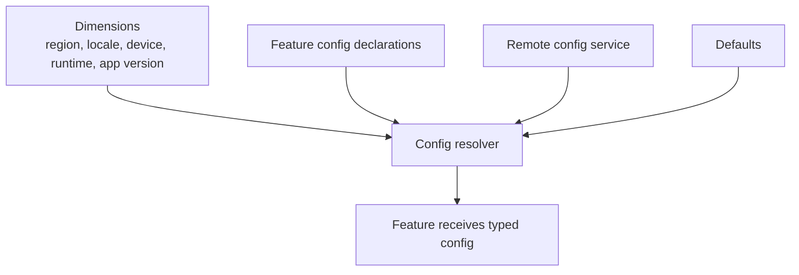

Typed config matters because config bugs are otherwise discovered as runtime weirdness.

## Platform Adapters

Once the runtime has a contract, each environment can implement it differently.

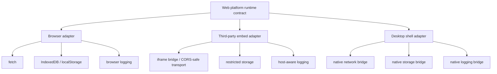

This is where the extra structure starts paying rent. Product features keep using one platform contract while the runtime chooses the right implementation for the environment.

It also keeps framework assumptions in check. A framework may assume the platform is a browser plus a Node server. Your product may need browser, embed, desktop, mobile webview, and worker surfaces. The platform layer is where those assumptions become explicit.

## Core Components Sit Above The Runtime

Core components can assume the runtime exists.

That lets a design system provide components that are already:

- instrumented
- localized
- accessible
- theme-aware
- compatible with platform navigation
- connected to platform config where needed

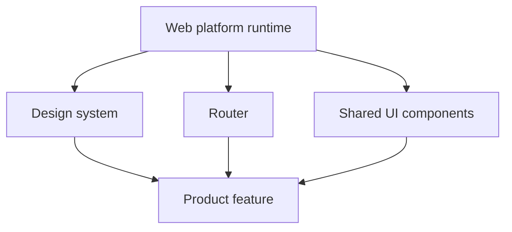

This is better than asking every feature to remember how to tag every button, load every translation, or log every error.

## A Practical Starting Point

Do not start by building a grand platform.

Start with the things every feature already reimplements:

1. logger
2. analytics client
3. IO client
4. localization runtime
5. polyfill policy
6. feature flag or config client
7. storage API
8. design system integration

Each one should have a small contract, a browser implementation, and a story for at least one non-browser environment if that is on the roadmap.

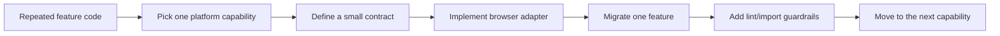

The goal is not to centralize everything. Centralize the parts where inconsistency is expensive.

## The Rule

If a product feature has to know which runtime it is running in, that is a smell.

Sometimes it is unavoidable. But most of the time, the feature should know what capability it needs, not which bridge, polyfill, storage backend, telemetry client, or config source provides it.

That is what a cross-platform web runtime buys you: not a bigger abstraction for its own sake, but a place to put the decisions that should not be rediscovered by every feature team.
