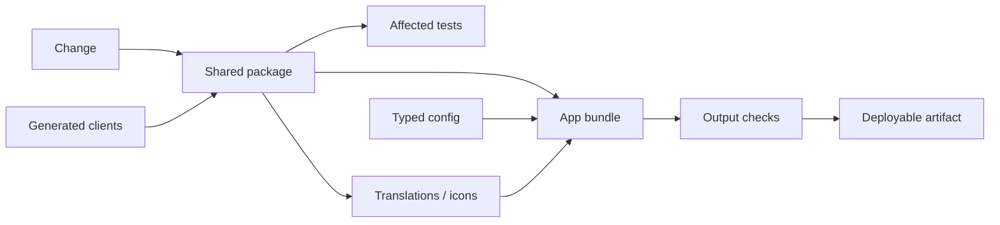

# Part 1: Why Bazel For Large Frontend Monorepos?

Frontend build systems usually start as a few package scripts:

```bash
pnpm dev
pnpm test
pnpm build
```

That is enough when there is one app, a few shared packages, and a small team. It stops being enough when the frontend becomes a graph: apps, SDK bundles, generated clients, translations, icons, tests, Storybook, browser extensions, edge workers, server bundles, static assets, and deployable images.

At that point, the question changes. It is no longer only:

> How do we build the app?

It becomes something more annoying:

> Which artifacts are affected by this change?

That is the point where Bazel starts to make sense.



## Package Scripts Hide The Graph

A package script is easy to read:

```json
{
  "scripts": {
    "build": "vite build",
    "test": "vitest run",
    "typecheck": "tsc --noEmit"
  }
}
```

The script is readable, but it hides almost everything the build actually cares about. It does not say which files are inputs, which packages are dependencies, which generated clients are required, which assets must be copied, or which downstream artifacts should be invalidated.

Task runners can improve this a lot. Turborepo and Nx both add structure, caching, and affected workflows. For many repositories, that is the right level of abstraction.

Bazel becomes interesting when the frontend graph needs more than package-level tasks. For example:

- generated REST, protobuf, or GraphQL TypeScript packages
- transitive translation extraction from colocated UI messages
- per-app icon sprite generation from reachable components
- route metadata aggregation across packages to detect collisions
- typed config files as build inputs
- test-only dependencies separated from runtime dependencies
- strict boundaries between app code, shared packages, examples, tests, and tools
- post-build verification over emitted bundles, including size budgets, environment replacement, sourcemap paths, and forbidden strings
- deployment targets that consume built artifacts instead of rediscovering files from the working directory
- selective side effects, such as uploading assets only when the artifact that feeds the upload changed

Those are not just commands. They are files, manifests, packages, checks, and uploads with dependencies.

Once you look at them that way, the system feels different. A translation catalog is not a random file that appears before build. It is an app-specific artifact derived from the dependency graph. A generated client is not just a prebuild step. It is a package with consumers. A CDN upload is not a shell command at the end of CI. It is a side effect attached to a verified bundle.

## Selective Builds Need Honest Boundaries

Selective builds are only useful if you can trust them.

If a package can import undeclared dependencies, read undeclared files, or rely on global workspace state, the build graph becomes a guess. It may be fast, but it is not trustworthy.

Bazel pushes teams toward explicit boundaries:

- source files are declared
- assets are declared
- dependencies are declared
- generated artifacts have labels
- config files are inputs
- tests have their own dependency surface
- deployment artifacts consume known outputs

There is a cost. BUILD files, macros, generators, and rules become real work. But the payoff is simple: a change to one package does not have to become a global frontend event.

## Where The Pain Shows Up

The pain usually does not appear on day one. It appears after the repository has a few generations of frontend architecture in it.

One team adds a shared component package. Another adds a browser extension. Another adds generated API clients. A platform team adds translation extraction. A design-system team adds icon sprites. A product team adds a second app. CI grows a pile of scripts that run "just to be safe."

Eventually, simple questions get expensive:

- Did this change affect the app shell?
- Do we need to rebuild every SDK?
- Which tests cover this shared package?
- Why did this bundle include that dependency?
- Which generated client version is being typechecked?
- Why did CI fail when local development worked?

Those questions get expensive because the graph already exists, but it lives in scripts, conventions, and memory. Bazel's value is making enough of that graph explicit that tools and humans can reason about it.

## The Real Goal

I do not think the goal is to make every frontend engineer a Bazel expert.

The common path should be boring:

- create a package
- split a package
- add a dependency
- add a test
- add a generated client
- build one app
- run affected tests
- understand CI failures

Good Bazel rules hide most of the machinery while preserving the graph. The rest of this series is about that balance: package anatomy, generated BUILD files, typechecking contracts, aspects, generated clients, Vite bundles, tests, output verification, deployment targets, dependency hygiene, and how Bazel compares with Turborepo and Nx.

Bazel is not the easiest frontend build tool to adopt. It asks the repository to be precise.

In a large monorepo, that precision is the feature.
