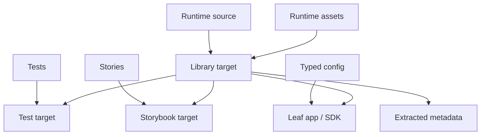
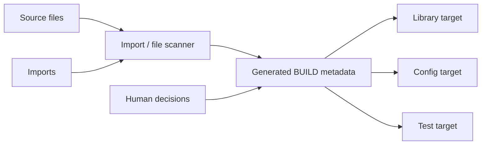

# Part 2: The Anatomy Of A Frontend Package

A frontend package is rarely just a folder of TypeScript files.

In a large monorepo, the same directory may contain runtime source, tests, stories, config files, fixtures, JSON, CSS, generated files, and static assets. Treating all of that as one project makes dependency boundaries fuzzy.

Bazel works better when a package is modeled as a small set of artifacts.



## Internal Packages Vs Leaf Packages

Internal packages are the pieces other code builds on. They expose components, hooks, clients, utilities, styles, or framework helpers.

Leaf packages produce something runnable or deployable: an app, SDK bundle, browser extension entry, worker script, example, or server artifact.

Those two shapes should not be modeled the same way. A shared library should not carry app deployment concerns. An app bundle should not pretend it is just another library.

## Why Not A New `package.json` Every Time?

In JavaScript workspaces, the natural instinct is to make every boundary a new package with its own `package.json`.

That can work, but it gets clunky at monorepo scale. Package names are global within the workspace, so every small boundary needs a unique, stable, bikeshed-prone name. Renaming a package becomes more expensive than moving a directory. Publishing-oriented metadata starts leaking into internal architecture. A tiny refactor can turn into package naming, exports, dependency metadata, and toolchain ceremony.

Bazel gives another option: a package boundary can be a BUILD package, not necessarily an npm package. The directory and target label can carry the internal boundary while the root package manager still owns installed third-party versions.

This is especially useful for package splitting. Moving code from `features/search/results` to `features/search/result-card` should not require inventing a public package name if the boundary is only internal to the repository.

## Split The Surfaces

A frontend package usually has several surfaces:

- **runtime source**: code that ships or is imported by other packages
- **tests**: test files, fixtures, test-only libraries
- **stories/examples**: documentation and demo surfaces
- **config**: Vite, Vitest, Storybook, Tailwind, codegen, or build tooling
- **assets**: JSON, CSS, SVG, images, translations, static files
- **generated outputs**: clients, manifests, locale metadata, sprites

The important rule: dependencies should attach to the surface that uses them.

A test runner belongs to the test target. A Vite plugin belongs to the config target. A browser-only library belongs to browser runtime source. A generated client belongs to the package that imports it.

This keeps production dependencies cleaner and makes selective builds less hand-wavy.

## Companion Targets

One package may expand into several predictable targets:

- library
- typecheck
- runtime source sidecar
- unit tests
- Storybook build
- visual tests
- extracted translations
- extracted icon usage
- internal dependency metadata

Developers should not handwrite all of this every time. A macro or generator can create the standard targets from conventions. The useful part is the predictable shape: downstream rules can rely on stable names and known behavior.

## Why This Shape Helps

This structure pays off when code moves, which is the part people tend to underestimate.

If a test file changes, the test target should be invalidated. The production bundle usually should not be. If a Storybook story changes, the Storybook target should rebuild. Runtime consumers should not inherit Storybook dependencies. If a generated locale file changes, app bundles that consume it should rebuild, but unrelated packages should stay out of the blast radius.

That is the practical reason to split package surfaces. It is not just tidier modeling. It gives the build system enough information to skip work without guessing.

It also gives better errors. "The config target is missing a dependency" is much more useful than "the package failed." "This test imports an undeclared fixture" is better than a mysterious CI-only file-not-found error.

## Assets Are Inputs

Frontend packages are rarely pure TypeScript.

If source imports JSON, the JSON is an input. If a component imports CSS, the CSS is an input. If tests need fixtures, fixtures are inputs. If an app embeds translations or sprites, those generated files are inputs.

Sandboxed builds are blunt here, in a useful way. If an action reads a file that was not declared, the build should fail. That failure means the graph is missing an edge.

## Visibility Is Architecture

Package visibility can feel bureaucratic until it catches the first bad dependency. Then it starts to look like architecture encoded in the build graph.

A design-system package may expose supported components and hide internals. An app feature may be visible only within that app. A generated client may be broadly visible. A test helper may be visible only to tests.

Without visibility, every package can depend on every other package. That is how internal implementation details become public APIs by accident.

There is also a useful convention from Go: directories named `internal` can only be imported by code within the parent tree. Frontend monorepos can copy that idea even if the language does not enforce it natively.

For example, `features/search/internal/ranking` can be treated as visible only to `features/search/...`. A lint rule or import-boundary check can enforce the convention. Bazel visibility can enforce it at the build graph layer. Together, they let packages have private implementation subtrees without turning every helper into a globally importable module.

## The Package Checklist

A good package answers these questions clearly:

- What code ships?
- What code tests it?
- What config builds it?
- What assets does it need?
- What generated artifacts does it consume?
- What metadata does it expose?
- Who may depend on it?

Bazel does not answer those questions automatically. The build rules have to encode them. Once they do, a package boundary becomes more than a folder convention. It becomes a useful interface to the frontend graph.

## Where Codegen Fits

The best BUILD file is often the one most engineers do not have to edit.

Large frontend repositories change constantly: files move, packages split, tests appear, generated clients change, and imports drift. If every one of those changes requires careful BUILD-file surgery, the build system becomes a tax on refactoring.

Generation is how you keep Bazel precise without making it tedious.



Codegen is good at mechanical facts: source files, test files, story files, config files, static assets, import paths, npm packages, internal deps, and generated-package deps.

Humans should still own architectural choices: visibility, package boundaries, deployability, unusual runtime assets, intentional ambient deps, and special bundling behavior.

The generator emits the common shape. The rules own the behavior.

One promising tool in this space is [`hermeticbuild/gazelle_ts`](https://github.com/hermeticbuild/gazelle_ts), a Gazelle TypeScript language extension that generates abstract TypeScript rule kinds and lets consumers map those kinds to project-specific macros. The important idea is the abstraction boundary: the generator can own source/test/config/import discovery while the repository still owns the concrete rule behavior.

## Stable Target Names Are APIs

Generated targets should be predictable. For a package named `ui`, a repository might consistently create `:ui`, `:ui_typecheck`, `:ui_srcs`, `:vitest_test`, `:extracted_translations`, and `:extracted_sprite_icons`.

The names are less important than the stability. Other rules can compose those targets without knowing the package internals.

Stable target names are build-system APIs. Treat them that way.

## Package Splitting Should Be Boring

Package splitting is a great test of build ergonomics.

The desired workflow is: move files, update imports, run the generator, and run affected tests.

If splitting requires hand-editing several build targets, copy-pasting config, and guessing dependency lists, engineers will avoid it. The repository will accumulate oversized packages because the better shape is too expensive.

Bazel provides the precise graph. Codegen makes that graph affordable to maintain.

## Absolute Imports Help Refactors

Generated dependency metadata works especially well with stable absolute imports.

Relative imports are fine inside a tiny package, but they become noisy when files move:

```ts
import { formatDate } from "../../../common/date";
```

Move the file one directory deeper and the import changes even though the dependency did not.

Absolute subpath imports avoid that churn:

```ts
import { formatDate } from "#features/common/date";
```

The import describes the logical dependency rather than the file's current relative position. That is more ergonomic for refactors, and it gives tools like Gazelle a stable string to resolve into a Bazel label.
