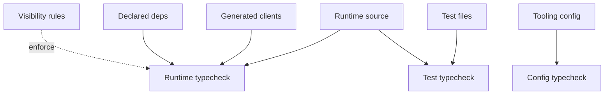

# Part 3: Typechecking And Dependency Hygiene

Most TypeScript projects start with one command:

```bash
tsc --noEmit
```

Large frontend monorepos usually need more than one TypeScript contract. Runtime source, tests, config files, generated clients, browser code, server code, examples, and tools all have different assumptions.

One giant typecheck usually becomes too loose, too slow, or both.



## Typecheck Is Not Transpile

Typechecking asks: is this code valid?

Transpilation asks: what JavaScript and declarations should be emitted?

Bundling asks: what runtime artifact should be loaded?

Those are different jobs. A shared library may emit declarations. A Vite app root may typecheck but not emit JavaScript because the bundler owns output. A config file may typecheck but never become runtime code.

Bazel lets those jobs be separate targets.

This matters for performance too. Typechecking can be significantly slower than transpilation because it needs semantic analysis across files and declarations. Modern tooling reflects that split: [`Oxc`](https://oxc.rs/) focuses on a high-performance JavaScript/TypeScript toolchain, including fast parsing and transformation, while TypeScript's native Go effort, exposed through the `tsgo` entry point in the TypeScript 7 beta, exists specifically because TypeScript performance is important enough to justify a native implementation path.

The build graph should take advantage of that distinction. Fast transpilation or bundling can happen where JavaScript output is needed. Typechecking can run as its own target, cached independently, and scoped to the surface that actually needs that contract.

## Split The Contracts

Runtime source should include runtime dependencies and exclude tests, stories, examples, and tools. If runtime code imports a test helper or Node-only package, the runtime target should fail.

Tests need their own contract. They often import assertion libraries, DOM simulators, mock servers, fixtures, and snapshot utilities. Those dependencies should not leak into runtime libraries.

Config files are code too. `vite.config.ts`, `vitest.config.ts`, Storybook config, Tailwind config, and codegen config can all import packages and change output artifacts. A bundler plugin belongs to the config target, not every runtime package the app imports.

Generated clients should be declared typecheck inputs, not ambient files that happen to exist locally. Browser code should typecheck against browser APIs. Server code should typecheck against server APIs. Worker code may need a third contract.

## The Dependency Side

A root `package.json` says what is installed. A Bazel target's deps say what that target uses.

Those are different. A workspace may install hundreds of packages. A component should depend on a small, explicit subset.

Runtime deps belong to runtime source. Test deps belong to tests. Config deps belong to config targets. Generated deps belong to packages that import generated artifacts.

Dependency placement is architecture.

Ambient deps should be rare and reviewed. Visibility rules should catch accidental architecture. Shared packages should not import app packages. Browser-only packages should not import server-only modules. Generated packages should not depend on handwritten app code.

Circular dependencies should be treated as build graph bugs, not harmless TypeScript trivia. They make initialization order fragile, make tests harder to isolate, and make package splitting much harder. Bazel's explicit dependency graph gives teams a natural place to detect and reject cycles between packages.

This is another place where the frontend can borrow from stricter ecosystems. If a package graph has a cycle, the boundary is usually wrong: either a shared lower-level package needs to be extracted, or one package is reaching through another package's public API in the wrong direction.

## A Concrete Failure Mode

Imagine one global typecheck that includes runtime source, tests, config files, and Node scripts.

To make that pass, the tsconfig often grows broad: DOM types, Node types, test globals, bundler globals, generated paths, and tool-specific settings all live together. That can hide real bugs. Browser code may accidentally use a Node API. Server code may accidentally assume the DOM. Runtime source may import a test helper. Config-only dependencies may appear available everywhere.

Separate typecheck targets and dependency surfaces make those mistakes visible. The stricter model is often less painful because failures are more specific.

## Make Failures Fixable

Dependency checks should not feel like riddles.

A good failure says which import caused the problem, which target owns the importing file, and whether the missing dependency belongs to runtime, test, config, or generated deps. A visibility failure should explain which boundary was crossed.

Strictness works when the correct fix is obvious. If people have to guess, they will add broad dependencies or look for workarounds.

## Lint Rules Need Typecheck Too

Lint rules are code, and serious frontend lint rules often depend on type information.

An import-boundary rule may need to understand generated import aliases. An `internal`-directory rule may need to resolve absolute subpath imports. A rule banning browser APIs in server code may need to know which files belong to which surface. A rule that detects unsafe framework usage may need TypeScript's semantic model rather than just syntax.

That means lint tooling has its own contract. The lint rule implementation should typecheck. Its test fixtures should typecheck where relevant. Its target should declare the same generated package mappings and type roots it needs to reason about source accurately.

Otherwise, lint becomes a parallel, weaker build system that guesses at the graph.
