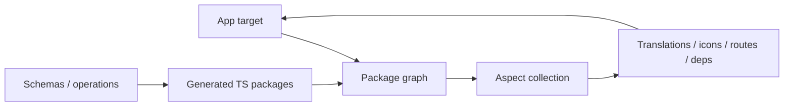
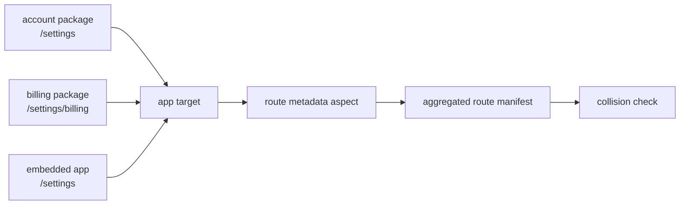

# Part 4: Transitive Metadata And Generated Packages

Some frontend build inputs are not local to a package, and some are not handwritten source at all.

Translations, icon sprites, route metadata, internal dependency reports, REST clients, protobuf declarations, and GraphQL operation packages all sit in the middle. They are source-like enough for apps to consume, but generated or aggregated enough that package scripts handle them poorly.

This is where Bazel's graph model is useful in a very practical way.



## Aspects For Transitive Metadata

A package can typecheck itself. A test can run its own files. But questions like these are different:

> Which translations, icons, routes, and internal packages are reachable from this app?

Those are graph questions. Bazel aspects are one way to answer them without scanning the entire repository or maintaining brittle manifests by hand.

A normal rule says: given these inputs, produce these outputs. An aspect says: while walking this dependency graph, collect something from every target you visit.

## Translations And Icons

Translations are a natural fit. Messages often live in shared components, feature packages, and app code. An app catalog should include strings reachable from the app, not every string in the monorepo.

[`FormatJS`](https://formatjs.github.io/) is a good concrete example of this workflow. Its [application workflow guide](https://formatjs.github.io/docs/getting-started/application-workflow/) describes extraction as the step that aggregates `defaultMessage`s and descriptions into JSON for translation, followed by editing or uploading/downloading translations through a translation service.

That model is much easier to live with when messages are colocated with the components that own them. A button owns its label. An empty state owns its copy. A feature owns its messages. Engineers do not have to update a distant central translation file every time they move UI code.

Bazel then gives the missing monorepo piece: extraction can follow the dependency graph. Shared packages can colocate messages locally, while an app target aggregates only the messages reachable from that app. [`rules_formatjs`](https://registry.bazel.build/modules/rules_formatjs) is a useful reference point for modeling FormatJS extraction in Bazel. The result is the best of both worlds: colocated source ergonomics and app-level translation artifacts.

Icon sprites work the same way. A design system may ship thousands of icons. Most apps use a small subset. A production build can statically extract icon names from source, aggregate usage through dependencies, and generate a filtered sprite.

The app does not need to know which shared component used which icon. The graph already has that information.

## Route Collision Checks

Routes are another useful example because collisions are often not local.

One package may contribute account routes. Another may contribute settings routes. A third may contribute an embedded app or route group mounted under a shared prefix. Each package can look correct in isolation, while the final app accidentally registers two handlers for the same path.

An aspect can collect route metadata across the app graph and feed a collision check:



The check can validate more than exact duplicates. It can catch conflicting dynamic patterns like `/teams/:id` and `/teams/new`, overlapping catch-all routes, incompatible layouts mounted at the same prefix, or two apps trying to own the same browser extension route.

The important part is ownership. Individual packages own local route declarations. The app owns the aggregate route table. Bazel provides the graph walk that connects the two without a manually maintained central manifest.

## Generated Packages

Generated TypeScript should be produced by labeled targets, and consumers should depend on those targets.

REST clients may come from OpenAPI, TypeSpec, framework route schemas, or service contracts. Protobuf-generated frontend types may include cross-package references. GraphQL operation packages may emit typed documents, result types, persisted-query hashes, and upload manifests.

These are not ghost dependencies. Schemas are inputs. Generated TypeScript is output. Consumers depend on generated package targets.

## Import Conventions

Generated imports should be visually distinct and stable:

```ts
import { client } from "#generated/rest/users/client.js";
import type { Message } from "#generated/protobuf/messages/Message.js";
import { SearchQuery } from "#generated/graphql/search.graphql.js";
```

The exact namespace does not matter. What matters is that generated imports map cleanly to generated build targets.

## Direct Deps Still Matter

A generated import namespace does not remove the need for dependency declarations.

If a package imports a generated REST client, it should depend on that REST client target. If it imports generated protobuf declarations, it should depend on the protobuf target. If it imports generated GraphQL operations, it should depend on the operation package.

This matters for build correctness, but it also matters for review. A new generated client dependency often means the package now talks to a new service or relies on a new contract. That is architectural information.

The broader pattern is the same for aspects and generated packages: stop relying on side effects that happen to run first, and give the artifacts names in the graph.
