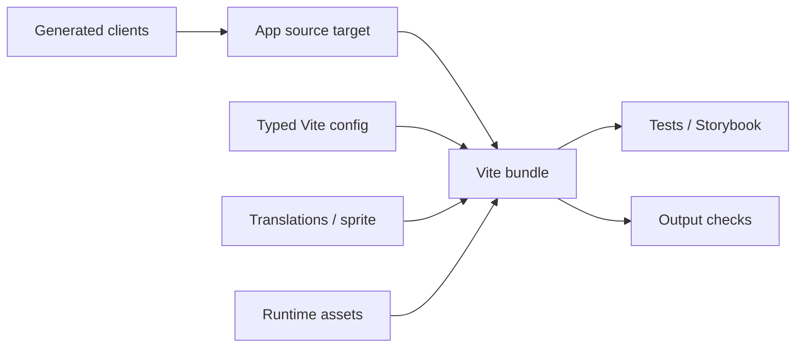

# Part 5: Apps, SDKs, And Tests In The Build Graph

Bazel should not replace Vite.

Vite is good at bundling frontend code. Bazel is good at modeling repository-scale inputs and outputs. Large frontend monorepos need both.

The split I like is:

> Bazel decides what the app needs. Vite turns it into a bundle.

## Apps Are Leaf Nodes

Internal packages are composable. Apps and SDKs are leaf nodes.

A leaf target produces something runnable or deployable: a web app bundle, static SDK directory, browser-extension entry, iframe embed, worker script, or server asset directory.

The app target should gather exactly what it needs: source, config, generated clients, assets, translations, sprites, and environment inputs.

## Source And Config Are Separate

Runtime source depends on React, shared packages, state libraries, generated clients, and assets. Config depends on Vite, plugins, CSS tooling, and build helpers.

Those dependency sets should not be mixed.

A Vite plugin is not a runtime dependency just because it builds runtime code.

## App Roots May Typecheck Without Emitting

Shared TypeScript libraries often emit declarations and JavaScript.

Vite app roots are different. The bundler owns the final JavaScript. The app source target may only need to typecheck, expose runtime files, and provide metadata for translations or sprites.

This avoids output collisions and keeps responsibilities clear.

## Tests Are Consumers

Tests are not runtime source. They are consumers of runtime source.

A test target should depend on the package under test, plus test files and test-only dependencies. That gives a clean split: runtime typecheck can pass or fail independently, test typecheck can include test-only libraries, and production bundles do not inherit test dependencies.

Storybook and visual tests are also consumers. They may need browsers, fonts, screenshots, fixtures, themes, and Storybook packages. Those dependencies are heavy. They should be explicit, and they should not leak into runtime package deps.

## Assets, Fixtures, And Environment Inputs

Vite actions and test actions need more than `.ts` files: CSS, JSON, SVG, static files, translation files, generated sprites, fixtures, snapshots, and environment-shaped values.

If an action reads a file, that file should be in the graph. If a client bundle needs a public environment value, that value should be modeled as a build input. If a server runtime needs an env file, that should be separate from client-side replacement.

A reliable app or test is not just code. It is code plus declared data.

## Output Shape Is Part Of The API

Different Vite targets need different output shapes.

An app may emit an entire `dist` directory. A browser-extension background script may need a specific `background.js` file. An embedded SDK may need stable filenames. A server app may need static assets copied into another package.

Those output shapes are not incidental. Downstream verification, uploads, images, workers, and tests depend on them.

That is how "run Vite" becomes a reliable artifact-producing target instead of a script that happens to work on one machine.
