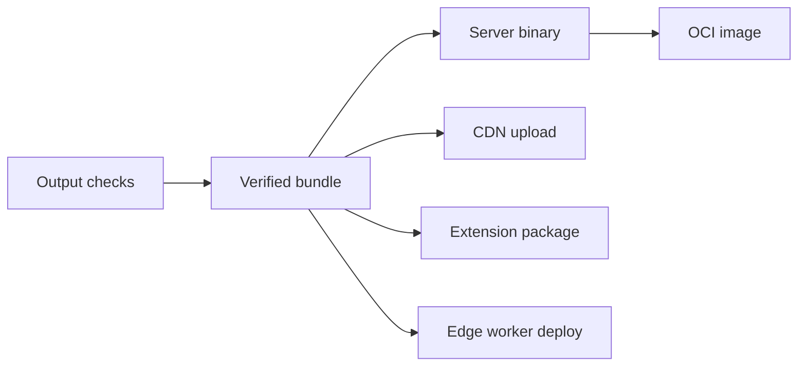

# Part 6: Verifying And Deploying Frontend Artifacts

A successful bundle is not the same thing as a correct artifact.

The bundler answered one question:

> Can these inputs become output files?

The build still needs another question:

> Are those output files acceptable?



## Built Artifacts Are APIs

Bundles have consumers: browsers, servers, CDNs, deployment scripts, monitoring tools, extension packages, and image builders.

If output shape changes accidentally, those consumers can break even when the build succeeded.

Useful checks include file size, environment replacement, asset references, sourcemap paths, CDN paths, chunk policy, and forbidden patterns.

These checks should consume the built artifact, not the source tree.

## Concrete Built Asset Checks

A large SPA usually has a bunch of assumptions that nobody wants to check by hand. Put the cheap ones against the emitted `dist` directory.

Useful checks include:

- **forbidden strings in HTML**: restricted feature names, internal-only route names, or experiment scaffolding should not appear in public HTML.
- **sensitive constants in JS**: server-only identifiers, private enum values, or backend-only flags should not leak into public bundles.
- **expected chunk placement**: code intentionally split behind restricted or dynamic boundaries should emit under a known directory or filename pattern.
- **CSS loading behavior**: critical CSS should be present as a blocking stylesheet link if the app depends on it to avoid flash-of-unstyled-content.
- **runtime CSS invariants**: generated CSS can be scanned for required or forbidden properties when browser behavior depends on them.
- **bundle budgets by pattern**: vendor chunks, app-shell chunks, i18n chunks, route chunks, and CSS can each have separate size limits.

That often looks like a few focused tests wired to the bundle target:

```python
output_scan_test(
    name = "env_var_no_leftover_test",
    rules = [":no_leftover_env_vars"],
    targets = [":app_bundle"],
)

output_scan_test(
    name = "critical_css_loading_test",
    rules = [":critical_css_is_blocking"],
    targets = [":app_bundle"],
)

file_size_test(
    name = "bundle_size_test",
    folder = ":app_bundle",
    pattern_size_map = {
        "**/vendors-*.js": 425,
        "**/app-shell-*.js": 350,
        "**/i18n-*.js": 300,
        "**/*.css": 565,
    },
)
```

The exact rule names do not matter. The important choice is that the checks read the built files. They catch the things source analysis cannot: a placeholder that survived replacement, a server-only string that became reachable, a chunk that moved into the wrong public bucket, or a CSS policy that disappeared during extraction.

## Source Checks Are Not Enough

Many output bugs do not exist in source form.

The source may contain `import.meta.env.PUBLIC_URL`, but the emitted bundle contains the actual string. The source may import a dynamic chunk, but the emitted manifest decides the filename. The source may configure sourcemaps, but the emitted comment determines what production debuggers see.

That is why output checks should inspect output. They validate the artifact the user, CDN, server, or monitoring system will actually see.

## Generated Assets Need Checks Too

Generated runtime assets deserve the same treatment as bundles.

Translation catalogs can be structurally invalid. Locale files can miss keys. Icon sprites can reference symbols that do not exist in the master sprite. Route manifests can point to stale outputs. GraphQL persisted-query manifests can miss operations.

These checks are usually cheap compared with finding the problem after deployment. If a generated asset affects runtime behavior, it should have a verification target.

## Deployment Is A Consumer

Deployment should not rediscover files from the working directory.

The cleaner path is:

1. Build targets produce artifacts.
2. Verification targets validate artifacts.
3. Deployment targets consume artifacts.

Server bundles, frontend images, CDN uploads, browser extensions, and edge workers are all consumers of the artifact graph.

## Upload Checks Are Artifact Checks Too

Deployment checks should verify that upload targets and emitted paths agree.

For example:

- **public asset uploads exclude source maps** so `.map` files do not get served as ordinary static assets.
- **source maps upload through a separate target** with the same public URL prefix the browser will use for minified files.
- **restricted or private debug artifacts use a separate destination** from normal public assets.
- **CDN base paths appear in the emitted bundle** so runtime asset resolution matches the deployment environment.
- **source map URLs do not contain doubled path segments** such as `/assets/assets/`.
- **environment placeholders are fully replaced** and no placeholder-like values remain in emitted JS.
- **success markers wait for every required side effect** instead of marking a deployment ready after only one upload step.
- **signed packages are conditional on signing material** so local and CI builds can still produce unsigned artifacts without pretending to publish them.

In Bazel, these become ordinary graph edges:

```python
upload_assets(
    name = "upload_public_assets",
    src = ":app_bundle",
    exclude = ["*.map"],
)

upload_sourcemaps(
    name = "upload_sourcemaps",
    src = ":app_bundle",
    minified_path_prefix = CDN_ASSET_PREFIX,
)

output_scan_test(
    name = "cdn_base_path_exists_test",
    rules = [":cdn_base_path_exists"],
    targets = [":app_bundle"],
)
```

This is the useful shift: the deployment script is no longer a pile of shell globbing. It is another consumer of the same verified artifact that tests and images consume.

## Selective Side Effects

Build systems usually focus on selective computation: only rebuild what changed. Frontend deploys also need selective side effects.

Uploading assets, publishing sourcemaps, deploying preview workers, registering GraphQL persisted queries, or syncing extension bundles should not happen just because a broad CI script ran. They should happen because the artifact they consume actually changed.

That is the same idea behind changed-target CI pipelines: compute the affected build graph first, then run the expensive or external side effects only for the affected artifacts.

The practical benefits are not glamorous, but they matter:

- fewer unnecessary uploads
- fewer flaky network operations
- less CI time
- lower risk of overwriting unchanged release artifacts
- clearer audit trails for what changed

The build graph gives the deployment layer a better trigger than "some frontend file changed." It can say "this exact bundle changed, so re-upload this exact artifact."

## Stamping And Preview Deploys

Deployment artifacts often need release metadata: commit SHA, version, environment, service name, or release ID. That does not mean every frontend build should be stamped. Stamping too much can hurt cacheability.

A practical split is: build cacheable artifacts first, verify them, then stamp or label only the targets that publish or package them.

Preview environments deserve the same treatment. They often use the same verified bundle as production with different hostnames, asset prefixes, routes, worker names, credentials, and cleanup policies.

Those differences should be modeled, not hidden in a script branch. The best preview systems are boring because they are just another consumer of the artifact graph.

The frontend graph is not done at `dist`. It is done when the verified artifact is ready to run.
