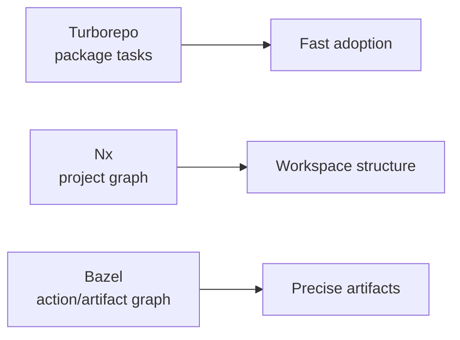

# Part 7: Bazel vs Turborepo vs Nx

Tool comparisons get annoying because they often ask the wrong question.

The useful question is not:

> Which monorepo tool is best?

It is:

> Which model matches the problems this repository actually has?

Bazel, Turborepo, and Nx are not three skins over the same idea. They operate at different levels of granularity.

## Turborepo: Package Task Orchestration

Turborepo is strongest when package scripts already describe the work well.

It gives teams task orchestration, caching, and an easy adoption path. If the main problem is "do not rerun unchanged `build`, `test`, and `typecheck` scripts," Turborepo is often the right answer.

That is a real need. Many frontend monorepos do not need custom build rules. They need to run familiar package scripts in the right order and avoid repeating work.

The tradeoff is granularity. Turborepo is fundamentally task-centered. You can add scripts for generated clients, output checks, and deployment packaging, but the model remains package-task orchestration. If a production artifact needs several typed intermediate artifacts and transitive metadata collections, those usually become scripts around the core model.

## Nx: Project Graph And Workspace Tooling

Nx adds a richer project graph, affected workflows, generators, framework integrations, and module boundary rules.

It is a strong fit when a repository wants more structure than package scripts but still wants tooling close to common frontend workflows. Nx generators can make project creation consistent. Affected commands can make CI much smarter. Module boundary rules can encode architecture directly in workspace tooling.

The tradeoff is that custom artifact pipelines may need plugins or escape hatches. If the repository's needs fit the Nx project model, it is productive. If the build becomes highly custom, the model may stretch.

For many frontend-heavy teams, Nx lands in a useful middle: more structure than package scripts, less custom infrastructure than Bazel.

## Bazel: Action And Artifact Graph

Bazel models targets, actions, inputs, outputs, providers, aspects, execution platforms, and caches.

That is more machinery. The reason to tolerate it is precision:

- generated packages as artifacts
- transitive metadata with aspects
- strict dependency declarations
- typed config targets
- output verification
- server/image/deploy targets
- cross-language contracts

The cost is real: steeper learning curve, more rule infrastructure, more BUILD metadata, and more need for build-platform ownership.

Bazel is usually not the cheapest initial choice. It starts to pay for itself when the repository already has artifact complexity that package tasks and project graphs struggle to express cleanly.

## The Real Tradeoff

This comparison is mostly about granularity.

Turborepo asks: which package tasks should run?

Nx asks: which projects and tasks are affected?

Bazel asks: which targets and actions produce which artifacts from which inputs?

More granularity gives more precision, but it also exposes more complexity. If the repository does not need that precision, Bazel can feel like overhead. If the repository does need it, package-level task orchestration can become a pile of scripts.

The right answer depends on where the complexity already lives.

## The Frontend-Specific Lens

For frontend monorepos, the dividing line is often generated and secondary artifacts.

If the repo mostly runs framework builds and tests, task orchestration may be enough. If it needs generated API packages, transitive translation extraction, icon sprites, output scans, server image assembly, and worker deploy targets, an artifact graph starts to look less optional.

That does not make Bazel universally better. It means Bazel is strongest when the build needs to understand things that are not naturally package scripts.

## A Practical Rule

Use Turborepo when package-level tasks are the right abstraction.

Use Nx when project graph tooling and generators solve the workspace problem.

Use Bazel when the repository needs explicit artifact modeling and custom graph behavior.

These tools are not on one ladder. They solve different scaling problems.

The mistake is choosing Bazel because it is powerful. Choose it when the precision is worth the ownership cost.
