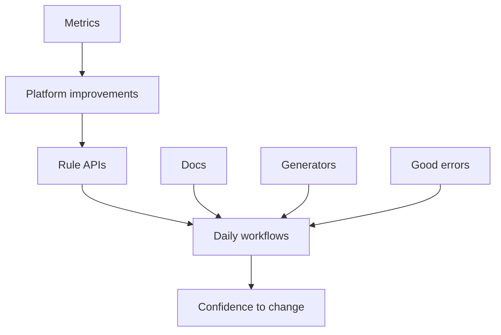

# Part 8: Operating The Build System As Product Infrastructure

A large frontend build system is not a one-time migration. It is infrastructure people use every day.

It has users, APIs, documentation, errors, adoption curves, metrics, and maintenance costs. If it is painful, frontend engineers will route around it.

## Build Rules Are APIs

A package macro is an API. A test rule is an API. An app rule is an API. A deploy rule is an API.

Good rule APIs have stable names, clear inputs, useful defaults, understandable outputs, documented escape hatches, and actionable failures.

The common path should be boring: add a component, add a test, split a package, update a generated client, run one app, debug CI. Those workflows should not require deep knowledge of providers, runfiles, execution platforms, or action graphs.

## Documentation, Errors, And Metrics

Strict systems need good docs and good errors.

A bad error says a target failed. A good error says which import is missing, which dependency list should change, and whether the problem is runtime, test, config, or generated code.

Useful metrics include CI duration, affected target count, cache hit rate, local test latency, dependency violations, bundle size trends, flaky test rate, and package split frequency.

These metrics are useful because they show whether the build system is helping the codebase change.

## Design For Deletion

Build platforms accumulate compatibility layers: old macros, aliases, migration flags, temporary generated files, special-case targets, and deprecated wrappers.

Every temporary path should have a way out. Can you find all remaining users? Is there a migration target? What condition allows deletion?

Bazel queries and dependency metadata can make cleanup practical. Without that discipline, yesterday's migration helper becomes tomorrow's permanent complexity.

A good build system is not only easy to add to. It is possible to simplify.

## Avoid The Platform Bottleneck

A build platform team should not have to approve every new package, test, app, or generated client.

The way out is self-service: generators, templates, documented patterns, and stable rule APIs. The platform team should spend most of its time improving the system, not translating every frontend change into build metadata by hand.

When common workflows are self-service, the build platform scales with the repository instead of becoming its narrowest point.

## Tighten Gradually

Do not turn every strict check on at once.

Measure first. Warn before failing. Start with new packages. Add autofixes. Ratchet over time.

The point is a repository that is easier to change, not a purity contest.

## The Final Point

This series has one recurring idea: large frontend monorepos are graph problems.

That graph includes source, tests, configs, generated clients, translations, sprites, bundles, output checks, servers, images, workers, and deployments.

Bazel is useful when teams need to model that graph precisely. But precision is not enough. The platform also needs ergonomics, codegen, documentation, good errors, metrics, and incremental adoption.

The thing you want is confidence: a change rebuilds the right things, tests the right things, ships the right artifacts, and leaves the rest alone.
