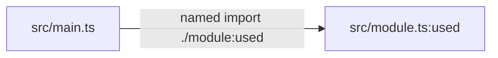

# Introducing Codescythe

We built [Codescythe](https://github.com/perplexityai/codescythe) because we had a pretty ordinary problem: our TypeScript codebase kept growing, and removing code was much harder than adding it.

Finding a file that looks unused is easy. Proving that it is safe to delete is not.

Imports hide behind aliases, barrels, dynamic `import()`, CommonJS, `import.meta.glob`, generated namespaces, and tests. Frameworks add entrypoints that are obvious at runtime but invisible from the source tree. One false positive is enough to make people stop trusting the report.

That was the real driver. We did not want another dead-code dashboard. We wanted a tool we could put in a cleanup loop:

1. Find code that appears dead.
2. Show why.
3. Call out gaps in the analysis.
4. Delete only when the evidence holds.

Codescythe is our attempt at making that loop boring.

## A Smaller Contract

Codescythe is inspired by [Knip](https://knip.dev), but deliberately narrower. Knip covers a broad JavaScript hygiene surface, including framework plugins, package metadata, dependencies, and workspace inference.

Codescythe asks for explicit entrypoints and project boundaries, then follows the actual import and export graph. It reports unused files, unused exports, and unresolved imports. It can remove supported dead code with `--fix`.

That smaller contract matters. Less inference means fewer surprising reasons for a file to be marked alive or dead. It also makes the result easier to explain to a human or hand to an agent.

```jsonc
{
  "entry": ["src/index.ts"],
  "project": ["src/**/*.{ts,tsx,js,jsx}"]
}
```

The graph understands static imports, re-exports, string-literal dynamic imports, destructured `require()` calls, `import.meta.glob`, package import maps, configured aliases, and test-file boundaries.

Codescythe is written in Rust, parses with Oxc, and walks reachable graph frontiers in parallel. On our pinned Kibana fixture it analyzes 90,931 files in 13.61 seconds, compared with 43.04 seconds for Knip. Codescythe solves a smaller problem; speed is one benefit of keeping it small.

## Show Me The Path

The most useful question is often not “is this file alive?” but “what keeps it alive?”

`query somepath` returns one shortest path between files, directories, or individual exports:

```sh
npx codescythe query somepath \
  src/main.ts \
  src/module.ts:used \
  --output mermaid
```

The output comes from the same graph used for dead-code analysis:



`query allpaths` returns the full subgraph between two selectors. Both commands support text, JSON, Mermaid, and SVG, so the result works in a terminal, a CI artifact, a PR description, or an agent workflow.

## Check The Analysis Before The Fix

Most bad dead-code results start with bad boundaries: a stale entry glob, an unresolved alias, or an ignore rule that hides real source.

`doctor` checks those risks without editing anything:

```sh
npx codescythe doctor --json --config codescythe.jsonc
```

For example:

```json
{
  "warnings": [
    {
      "code": "entryGlobZeroMatches",
      "message": "entry pattern \"src/app/**/*.tsx\" matched no project files"
    }
  ],
  "summary": {
    "projectCount": 842,
    "entryCount": 0
  }
}
```

That is a much better answer than confidently reporting 842 dead files.

`doctor` also explains unresolved imports, including matched aliases, expanded targets, candidate files, and whether each candidate exists inside the project. If an unresolved-import ignore overlaps a local source alias, Codescythe warns and can refuse `--fix` instead of silently weakening the graph.

## Catch Broken Lazy Boundaries

Once we trusted the graph, we found another useful question: which supposedly lazy modules are also imported eagerly?

```sh
npx codescythe query import-conflicts
```

Given both a static and dynamic path to the same module, Codescythe prints the conflicting edges and the shortest proof from one entrypoint:

```text
Found 1 module with runtime static/dynamic import conflicts:

src/module.ts
  runtime static imports:
    src/main.ts -- named import ./module
  dynamic imports:
    src/main.ts -- dynamic import ./module
  shortest conflicting entrypoint route (src/main.ts):
    runtime static path:
      src/main.ts
      -- named import ./module:value -> src/module.ts:value
    dynamic path:
      src/main.ts
      -- dynamic import ./module -> src/module.ts
```

This catches a common bundling mistake: code looks lazy because it uses `import()`, but another reachable static import already pulled it into the eager graph.

Type-only imports and configured test imports do not create runtime conflicts. Intentional preloads can be suppressed on one import edge with a required reason, without hiding conflicts elsewhere:

```ts
// codescythe-ignore-next-line import-conflict -- dedicated entrypoint preload
import { Page } from "./Page";
```

## Built For Agents Too

Code creation is getting cheaper. Agents can add a feature, copy a local pattern, and wire tests quickly. Code ownership did not get cheaper. Every retired experiment and obsolete export still makes the next search, build, and change harder.

We need a deletion loop that can keep up with the creation loop.

Codescythe has human-readable output, but its real interface is structured. Analysis results, warning codes, dependency nodes, typed edges, explanations, import conflicts, and fix reports are available as stable JSON. Exit codes distinguish findings from runtime failures.

That gives an agent something better than a wall of lint text. It can:

- run `doctor` and fix config risk first
- inspect a path when a result is surprising
- separate runtime-static, dynamic, and type-only edges
- apply `--fix`
- review exact removed files and exports
- rerun until the graph is stable

The agent still needs a review boundary. Codescythe makes that boundary explicit and machine-readable.

## Try It

```sh
npm install -D codescythe
npx codescythe doctor --config codescythe.jsonc
npx codescythe --verbose
```

Start with a narrow project glob. Make the entrypoints honest. Check surprising results with `--explain-export` or `query`. Then use `--fix`.

Codescythe is open source under Apache 2.0. Read the [documentation](https://perplexityai.github.io/codescythe/) or inspect the [architecture](https://github.com/perplexityai/codescythe/blob/main/ARCHITECTURE.md).

Finding dead code was never the hard part. The hard part was making deletion trustworthy enough to become routine.
