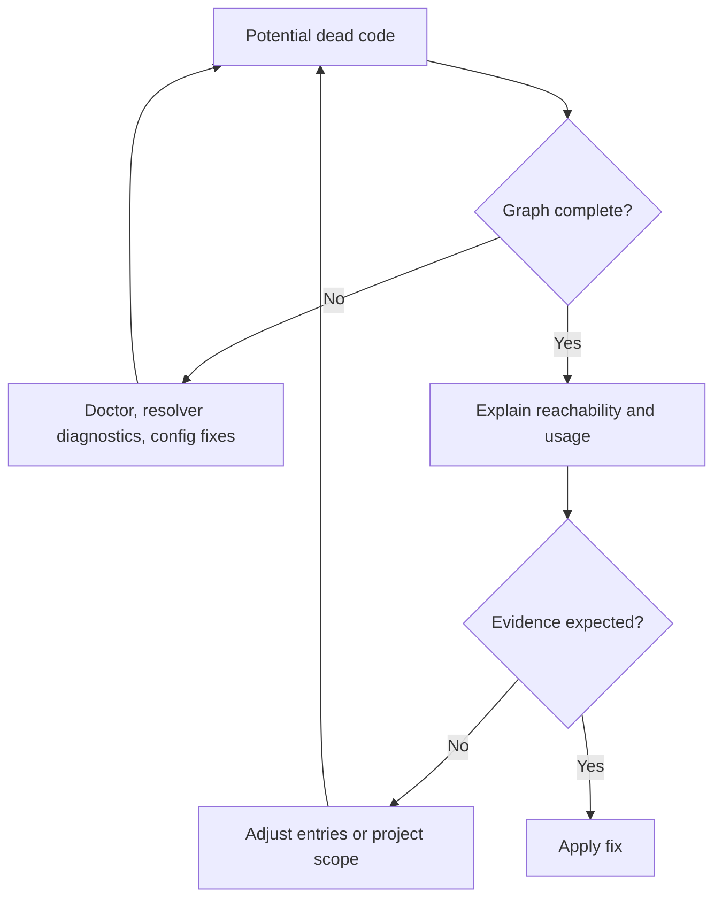
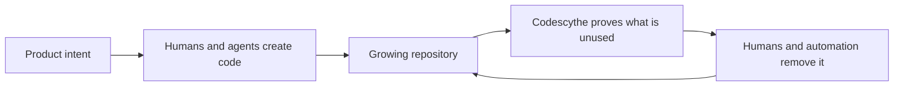

# Introducing Codescythe: Dead Code Should Be Easy To Prove

We built and open-sourced [Codescythe](https://github.com/perplexityai/codescythe), a fast dead-code analyzer and remover for TypeScript and JavaScript.

It finds unused files and exports, reports unresolved imports, removes supported dead code, diagnoses risky configuration, and shows the dependency paths behind its answers.

Those are the capabilities. They are not the main reason we built it.

We built Codescythe because deleting code is a trust problem.

## Finding Dead Code Is The Easy Part

In a small project, dead-code analysis looks simple:

1. Pick the entrypoints.
2. Follow imports.
3. Report everything else.

In a large TypeScript monorepo, every step gets complicated. Entrypoints come from several build systems. Imports travel through aliases, package `imports`, re-exports, dynamic imports, CommonJS, and generated namespaces. Tests use production code without necessarily making it part of the production graph. Frameworks invent entrypoints the source tree cannot see.

A tool can produce a long list anyway. The hard question starts after that:

**Do we trust it enough to delete the code?**

One false positive changes the workflow. Instead of applying a cleanup, an engineer has to inspect every result. Instead of running continuously, the tool becomes an occasional audit. Instead of shrinking the codebase, it adds another report nobody owns.

For dead-code removal, recall matters. Trust matters more.

## Why A Narrower Tool

[Knip](https://knip.dev) is the obvious reference here, and a very good one. It covers a broad JavaScript and TypeScript hygiene surface: framework plugins, package metadata, dependencies, binaries, workspace inference, unused files, and unused exports.

We did not want to rebuild all of that.

We wanted one smaller contract for a common monorepo maintenance job:

- project boundaries are explicit
- entrypoints are known
- source reachability follows real module resolution
- every unused file and export has a stable reason
- supported removals can run automatically

That decision defines Codescythe. It does not inspect every framework convention or guess every runtime entrypoint. If something starts the application, model it as an entry. If something belongs to the analysis, include it in the project.

Less inference gives the analyzer less magic to get wrong.

```mermaid
flowchart LR
  config["Explicit entries and project scope"] --> resolve["Oxc parsing and module resolution"]
  resolve --> graph["File and export graph"]
  graph --> findings["Unused files, exports, unresolved imports"]
  graph --> evidence["Explanations and dependency paths"]
  findings --> fix["Supported removals"]
  evidence --> trust["Reviewable evidence"]
  trust --> fix
```

This is not a claim that broad framework-aware analysis is bad. It is a choice about where we wanted confidence to come from: a constrained source graph instead of a growing integration surface.

## Built For Deletion

Codescythe starts from configured entry files, discovers the configured project, and follows imports and re-exports using the same kind of resolution behavior the codebase expects. It understands static imports, string-literal dynamic imports, destructured `require()` calls, `import.meta.glob`, package import maps, and configured aliases.

From that graph it reports:

- project files unreachable from any entry
- exports unused by reachable code
- unresolved imports that weaken the result

Then `--fix` removes supported unused files and export declarations.

The fix path is intentionally conservative. Ignoring an unresolved source import can make live code look dead, so Codescythe warns about risky ignore patterns and refuses unsafe fixes unless explicitly forced. When resolution leaves one file uncertain, it can skip editing that file instead of pretending the graph is complete.

That behavior is central to the product. A cleanup tool should know when its own evidence is weak.

## Explain Before Removing

Most static-analysis output stops at a location and a rule name. That is not enough when the proposed action is deletion.

Codescythe can explain why an export is alive or dead:

```sh
npx codescythe --explain-export src/constants.ts:getServerId
```

It also has a `doctor` command for checking configuration risk before a fix:

```sh
npx codescythe doctor --config codescythe.jsonc
```

`doctor` catches empty entry patterns, suspicious project-to-entry coverage, unresolved imports, and ignore patterns that overlap local source aliases. Verbose JSON exposes the same evidence in a stable shape for CI and other tools.

The useful model is not analyzer first, fixer second. It is evidence first, deletion second.



## The Graph Is Useful Beyond Cleanup

Once we had a source graph we trusted, another need kept appearing: not only “is this code used?” but “how do we reach it?”

Codescythe can query one shortest path or the complete subgraph between files, directories, and individual exports:

```sh
npx codescythe query somepath src/main.ts src/features/
npx codescythe query allpaths src/main.ts src/runtime.ts:initRuntime --output mermaid
```

The same query can produce text, JSON, Mermaid, or SVG.

That makes the analyzer useful for architecture work too. It can show why a supposedly isolated feature reaches a runtime dependency, which import path keeps an old module alive, or how a public entrypoint reaches one symbol through barrels and namespace imports.

The important part is that query and cleanup use the same graph. There is no separate visualization model giving a nicer but different answer.

## Fast Enough To Stay In The Loop

Trust disappears if analysis is wrong. Adoption disappears if it is slow.

Codescythe is written in Rust, parses with Oxc, resolves reachable graph frontiers in parallel, and avoids parsing unreachable source until reporting needs it.

Our pinned benchmark fixtures currently measure:

- VS Code: 9,398 files in 1.11 seconds
- Grafana: 8,358 files in 833 milliseconds
- Kibana: 90,931 files in 13.61 seconds
- Renovate: 2,456 files in 154 milliseconds

In the same fixtures, Knip took 4.22 seconds, 9.51 seconds, 43.04 seconds, and 900 milliseconds respectively. These are not universal numbers, and Codescythe is solving a narrower problem. That narrower problem is exactly what lets it stay fast and predictable.

## Why This Matters More Now

Code creation keeps getting cheaper. AI agents can add a feature, generate adapters, copy an existing pattern, and wire the tests in minutes.

Code ownership did not get cheaper.

Every generated branch, retired experiment, duplicate helper, and obsolete export still expands the surface humans and agents must search, understand, build, and change. Repositories need a deletion loop that can keep up with the creation loop.



That is the real driver behind Codescythe.

We did not need another dashboard counting stale code. We needed a small, deterministic engine that could become part of routine maintenance: run it, inspect evidence when necessary, remove what is proved dead, and repeat.

## Try It

Install the package:

```sh
npm install -D codescythe
```

Create a `codescythe.jsonc` with explicit entries and project files:

```jsonc
{
  "entry": ["src/index.ts"],
  "project": ["src/**/*.{ts,tsx,js,jsx}"]
}
```

Then analyze:

```sh
npx codescythe --verbose
```

Run `doctor` before the first destructive pass. Use `--explain-export` or `query` when a result is surprising. Once the graph matches the application, use `--fix`.

Codescythe is open source under Apache 2.0. Read the [documentation](https://perplexityai.github.io/codescythe/), inspect the [architecture](https://github.com/perplexityai/codescythe/blob/main/ARCHITECTURE.md), or try it on a package whose entrypoints you already understand.

Dead code should not survive because deletion feels dangerous. The tool proposing the deletion should make the evidence boring.
