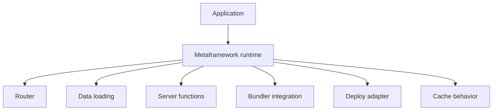
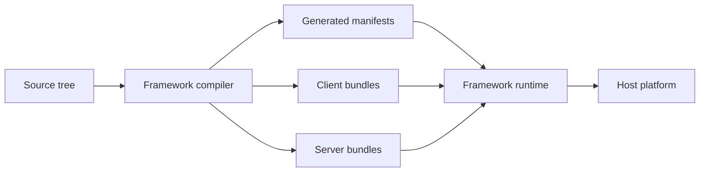
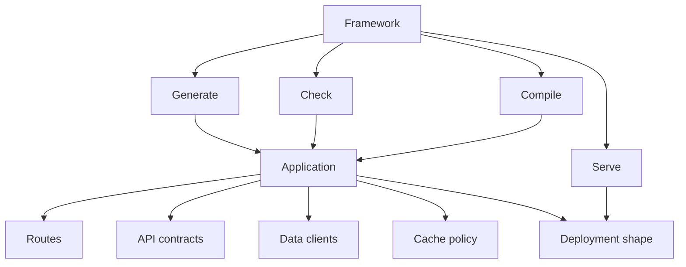

# The Metaframework Is Dead

The title is a little dramatic. I do not mean nobody should use Next, Remix, Astro, SvelteKit, or whatever comes next.

I mean the metaframework stopped being the most interesting boundary in the system.

For a long time, the deal was great: web apps had too many decisions, and a metaframework showed up with one coherent answer. Routing, rendering, data loading, server code, bundling, deployment, caching, images, CSS, and environment config all got pulled into one mental model.

That helped.

But the more the framework owns, the more the actual shape of the product disappears into runtime behavior, compiler transforms, generated manifests, and deployment adapter rules. At some point the app is not simpler. It is just harder to see.

The next useful move is not a bigger runtime. It is moving more work to build time, and letting generators and agents produce explicit code that teams can own.

## The Old Deal

The old deal was runtime consolidation.



That shape is seductive. Need a route? Put a file in the right directory. Need a mutation? Export a server function. Need caching? Use the blessed helper. Need deployment? Pick the adapter.

You get a lot done quickly because the framework makes big choices feel small.

The cost shows up later. The route is not just a file. The server function is not just a function. The cache is not just a cache. They are all pieces of a larger runtime contract, and that contract may be partly generated, partly inferred, and partly specific to one hosting path.

When everything important is hidden in framework convention, understanding the app means understanding the framework's private model of the app.

## The Runtime Got Too Important

Modern metaframeworks do not just render pages. They decide where code runs, split bundles, serialize server references, infer static and dynamic behavior, wrap request caches, generate manifests, and map one source tree onto several runtime targets.



Some of that belongs at runtime. Requests have to be served. Navigation has to work. Streaming has to run somewhere.

But a lot of the important shape can be decided before the app runs: route tables, API contracts, server reference maps, feature boundaries, entrypoints, asset graphs, environment policy, and deploy metadata.

Those are better as build outputs than vibes.

If the build can generate them, the build can also check them, diff them, document them, and fail early when they drift.

## Build Time Is The Better Boundary

The healthier version looks more like this:

```mermaid
flowchart TD
  source["Application source"] --> graph["Build graph"]
  graph --> generated["Generated app structure"]
  graph --> checks["Static checks"]
  graph --> bundles["Runtime bundles"]
  graph --> docs["Generated maps"]

  generated --> app["Owned application code"]
  checks --> app
  bundles --> deploy["Deployable artifacts"]
```

This changes the relationship with the framework.

The framework can still be powerful, but it is no longer the box the product lives inside. It becomes a generator, compiler, checker, and dev server for an app whose structure is visible.

That visibility matters. Reviewers can read a diff. Tests can point at concrete files. Boundary rules can run before deploy. A future teammate can inspect the route map or API contract without learning a pile of runtime inference rules first.

## Verbose Scaffolding Is Back

We spent years treating boilerplate as the enemy.

Some boilerplate is bad. Nobody wants to hand-wire the same fifteen files every time they add a page. Nobody wants copied data loaders that quietly drift.

But explicit scaffolding is different from busywork.

I would rather have:

- a real route module than a hidden route record
- a named server endpoint than an opaque server reference
- a visible cache policy than cache behavior inferred from callsite magic
- an import boundary enforced by the build than a package name pretending to be architecture

The old objection was fair: explicit code costs time.

That objection is weaker now. Agents and generators are good at boring code. They can create the route, wire the test, update the manifest, follow local naming conventions, and leave behind ordinary files.

```mermaid
flowchart LR
  intent["Developer intent"] --> agent["Agent or generator"]
  repo["Repo conventions"] --> agent
  graph["Build graph"] --> agent
  agent --> files["Concrete files"]
  files --> review["Human review"]
  review --> app["Owned app structure"]
```

The important part is the output. It should not be magic. It should be code the team can read, change, delete, and blame.

That is the part agents make newly cheap: not less structure, but more explicit structure with less typing.

## Default To Eject Mode

The best default is not "never use a framework." That is silly.

The best default is: use the framework as if you already ejected.



Eject mode does not mean giving up good tools. It means the framework helps create and maintain the application shape instead of hiding it.

The route tree can be conventional, but the route table should be visible. Server functions can be ergonomic, but the API boundary should be named. Caching can have defaults, but the policy should be inspectable. Deployment can be integrated, but the artifact should be understandable.

That is where "more boilerplate" starts to mean "less magic."

## The New Deal

The metaframework is dead as the central abstraction.

Not because routing, rendering, dev servers, or deployment adapters stopped mattering. They still matter a lot.

But the next jump is not another layer of runtime cleverness. It is build-time generation plus explicit ownership.

Use the framework to compile, optimize, and serve. Use the build graph to make the product shape concrete. Use agents to create the boring structure. Keep the important boundaries visible.

Start with the code you would want after the abstraction leaks, and let the tools help you keep it boring.
