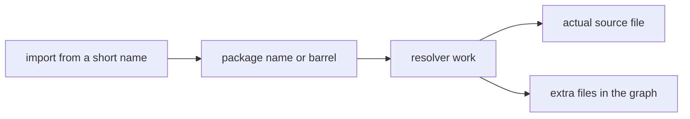

# A Package Is A Distribution Boundary

JavaScript monorepos often confuse two ideas:

- a folder of code with an owner
- an npm package with a public name

Those are not the same thing.

The common pattern is to put a `package.json` in every meaningful folder, give it a name like `@acme/payments`, add it to a workspace, and import it from other code:

```ts
import {calculateTax} from "@acme/payments";
```

That looks clean. It is also a lot of machinery for code that never leaves the repository.

If the package is not published, installed by another repository, or consumed through a stable external contract, the package name is not a product boundary. It is an alias. It adds a second naming system on top of the filesystem.

## The Package Name Trap

The filesystem already has a name for the code:

```text
packages/payments/calculate-tax.ts
```

The package manifest invents another one:

```json
{
  "name": "@acme/payments"
}
```

Now every tool has to answer questions that did not need to exist:

- Which folder owns `@acme/payments`?
- Is that name a workspace package, an installed dependency, or both?
- Does the import resolve to source, compiled output, or a package entrypoint?
- Which `exports`, `types`, `main`, `module`, and `sideEffects` fields matter for this tool?
- Does the bundler see the same graph as TypeScript, tests, lint, and the build system?

That indirection is tolerable for public packages because public packages need a distribution contract. It is much less compelling for private internal code.

The problem gets worse when internal packages use root entrypoints as their daily import surface:

```ts
import {Button, Modal, TextField} from "@acme/ui";
```

That entrypoint is usually a barrel file. It hides the source location behind a tidy import, but the tools still have to resolve the re-export graph. Marvin Hagemeister's ["The barrel file debacle"](https://marvinh.dev/blog/speeding-up-javascript-ecosystem-part-7/) is the canonical writeup here. The [Next.js local development guide](https://nextjs.org/docs/app/guides/local-development#barrel-files) now explicitly warns that barrel files can slow builds because the compiler has to parse them to check for side effects. Atlassian published a large migration story, ["How We Achieved 75% Faster Builds by Removing Barrel Files"](https://www.atlassian.com/blog/atlassian-engineering/faster-builds-when-removing-barrel-files), where removing barrel files improved TypeScript, test selection, and CI performance.

The shape of the mistake is the same:



A short import is not free if it makes every tool chase a larger graph.

Public package entrypoints are still useful. A published library should have a small, documented API. But that is the edge of the repository. It should not be the default way internal source files talk to each other.

## Relative Imports Are Not Great Either

The obvious alternative is relative imports:

```ts
import {calculateTax} from "../../payments/calculate-tax.js";
import {formatMoney} from "../../../core/money/format.js";
```

Relative imports are honest. They do not need package manager magic. They can be resolved from the importing file alone.

They are also annoying in a large codebase.

Move a file and the import path changes. Move a folder and all of its consumers may need edits. A dependency from checkout to payments is encoded as `../../..`, which is technically precise and semantically useless.

Relative paths make local file movement expensive and make architecture harder to read. They answer "how do I walk the directory tree from here?" when the code reviewer wants to know "which module does this depend on?"

So the useful target is not package names or relative paths. The useful target is absolute imports over the repository's source tree.

## Use One Root Import Space

For Node and TypeScript projects, the cleanest version is a single private root `package.json` with a [`package.json#imports`](https://nodejs.org/api/packages.html#imports) map. TypeScript supports these package imports in `node16`, `nodenext`, and `bundler` module resolution modes:

```json
{
  "private": true,
  "type": "module",
  "imports": {
    "#apps/*": "./apps/*",
    "#packages/*": "./packages/*",
    "#tools/*": "./tools/*"
  }
}
```

Then source imports by repository path:

```ts
import {calculateTax} from "#packages/payments/calculate-tax.js";
import {formatMoney} from "#packages/core/money/format.js";
```

This has a few nice properties.

The import path is stable when the importing file moves. The path describes the dependency. The resolver has one root map instead of one package manifest per internal folder. TypeScript, Node, tests, lint, and bundlers can share the same naming convention instead of each growing a slightly different alias system.

It also matches how many other language ecosystems feel in practice. Go imports by module path plus directory. Rust code commonly uses crate-rooted paths like `crate::feature::module`. Python packages usually import from a package root instead of walking the tree from every file. Java and Kotlin package names are absolute namespaces.

The important idea is not that JavaScript should become Go or Rust. It is that internal code should have a stable absolute address that corresponds to the source tree.

## Boundaries Are Not Resolution

The usual objection is:

> If everyone can import any source file, how do we keep boundaries?

That is the right question. But package names are a clumsy answer.

Resolution and visibility are different jobs. Absolute imports should tell tools where a file is. Boundary rules should tell developers whether that dependency is allowed.

Go has a useful convention here. A directory named [`internal`](https://go.dev/doc/go1.4#internalpackages) can only be imported by code in the parent tree. In a TypeScript monorepo, the same convention is easy to read:

```text
packages/
  checkout/
    checkout-page.tsx
    internal/
      price-breakdown.ts
      shipping-rules.ts
  payments/
    charge-card.ts
```

These imports should be allowed:

```ts
import {renderPriceBreakdown} from "#packages/checkout/internal/price-breakdown.js";
```

from code under `packages/checkout`.

The same import should be rejected from `packages/payments`, `packages/search`, or an app that happens to know the file exists.

That enforcement can live in lint rules, build-system visibility, dependency-cruiser, Nx module boundaries, a custom ESLint rule, Bazel visibility, or a small repository-specific checker. The rule needs to compare the importer path with the imported path. A simple string alias cannot do that.

This is the important split:

- Import maps make files addressable.
- Boundary checks decide which addresses are allowed.
- Package manifests describe artifacts that leave the repository.

When those jobs are separate, each one gets simpler.

## package.json Is For Public Artifacts

`package.json` is good at describing an npm package. That is its job.

Use one when the code is consumed outside the monorepo:

- a public npm package
- a private package published to an internal registry
- an SDK installed by another repository
- a plugin package loaded by a package manager
- a package with semver, changelog, peer dependencies, and an external API

In that world, `package.json` fields are real product surface:

```json
{
  "name": "@acme/payments-sdk",
  "version": "3.2.0",
  "type": "module",
  "exports": {
    ".": "./index.js",
    "./testing": "./testing.js"
  },
  "types": "index.d.ts",
  "peerDependencies": {
    "react": "^19.0.0"
  }
}
```

That is a distribution contract. Consumers outside the repository should not know your source tree. They should know the public package name and the public subpaths you support.

Internal code is different. If the only consumer is the same repository, a package manifest often becomes ceremony:

- fake versions
- fake package names
- fake publish boundaries
- dependency lists that duplicate build metadata
- generated `exports` fields for code that is never exported
- package manager linking for code that could be resolved directly

It is not that internal package manifests never work. It is that they are often solving the wrong problem.

## FormatJS Is A Useful Example

The [FormatJS repository](https://github.com/formatjs/formatjs) is a good one to look at because it is both a real public library monorepo and a modern TypeScript codebase.

The repository publishes real packages such as `@formatjs/intl`, `@formatjs/cli`, `@formatjs/icu-messageformat-parser`, `intl-messageformat`, and `react-intl`. Those packages deserve package manifests because people install them from outside the repo.

The interesting bit is that the [root package](https://github.com/formatjs/formatjs/blob/main/package.json) is private and defines an internal import map:

```json
{
  "name": "formatjs-repo",
  "private": true,
  "imports": {
    "#packages/*": "./packages/*"
  }
}
```

That lets source files import by repository path:

```ts
import {type MessageDescriptor} from "#packages/intl/types.js";
export * from "#packages/intl/types.js";
```

`react-intl` does the same thing for its own internals:

```ts
import {
  createFormattedComponent,
  createFormattedDateTimePartsComponent,
} from "#packages/react-intl/components/createFormattedComponent.js";
```

At the same time, `react-intl` also imports and re-exports the public `@formatjs/intl` package:

```ts
export {
  createIntlCache,
  type FormatDateOptions,
  type MessageDescriptor,
} from "@formatjs/intl";
```

That distinction is the whole point.

FormatJS still has package manifests for publishable artifacts. [`@formatjs/intl`](https://github.com/formatjs/formatjs/blob/main/packages/intl/package.json) has `name`, `version`, `exports`, `types`, and `workspace:*` dependencies. [`react-intl`](https://github.com/formatjs/formatjs/blob/main/packages/react-intl/package.json) has its own manifest, peer dependencies, and public subpath exports. Those are real package boundaries because external users install them.

But internal source references do not have to pretend every folder is an npm package. The root `#packages/*` map gives the repository a stable internal address space.

FormatJS is not an argument against package manifests. It is an argument for putting them at the distribution boundary, not every source boundary.

There is one nuance: public package entrypoints still look like barrels. [`packages/intl/index.ts`](https://github.com/formatjs/formatjs/blob/main/packages/intl/index.ts) re-exports the API for `@formatjs/intl`, and [`packages/react-intl/index.ts`](https://github.com/formatjs/formatjs/blob/main/packages/react-intl/index.ts) does the same for React users. That is reasonable because a public package needs a public API.

The mistake would be forcing all internal code to go through those public entrypoints when it really depends on a specific source module.

## Pick Tooling That Does Not Require Fake Packages

The build system should let you create a code boundary without creating an npm package.

You should be able to say:

- these files form a unit
- these are its runtime dependencies
- these are its test dependencies
- this is how to typecheck it
- this is how to test it
- these imports are allowed
- these imports are forbidden

None of that inherently requires a `package.json`.

Some tools make package manifests the only project discovery mechanism. That nudges teams into creating fake npm packages just to get typechecking, tests, cache keys, ownership, or dependency boundaries. At small scale, this feels fine. At large scale, the repository accumulates a second filesystem made out of package names.

Better tooling lets packages be arbitrary source units. Bazel targets can do this. Custom TypeScript project generators can do this. Nx can do parts of this with project configuration and module boundary rules. A repo-specific lint or dependency checker can do this. The exact tool matters less than the capability.

The common workflow should be:

```text
create folder -> add source -> add test target -> import by absolute path -> enforce boundaries
```

not:

```text
create folder -> invent package name -> add package.json -> update workspace -> teach every tool how to resolve the fake package -> import through entrypoint -> fight barrels later
```

## The Rule

Use package names for code that leaves the monorepo.

Use absolute root imports for code that lives inside the monorepo.

Use `internal` folders and lint/build visibility for private implementation details.

Use public package entrypoints only at real public package boundaries.

That gives the repository one source address space, real distribution contracts where they matter, and fewer layers of indirection for every tool that has to understand the graph.
