# Next Server Actions Are Not An API Boundary

Server Actions are one of the nicest parts of modern Next.js.

You write an async function, mark it with `"use server"`, pass it to a form or import it from a client component, and Next handles the wiring. For small mutations close to the UI, that feels great.

The catch is that the wiring is still an API. It is just an API generated by the framework.

That starts to matter when an app is deployed continuously, cached by browsers and CDNs, or served by more than one backend version at the same time.

## The Normal Shape

Without Server Actions, a client mutation usually has an explicit endpoint:

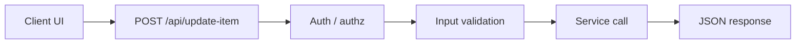

That endpoint is visible. You can give it a stable path, a schema, rate limits, logs, dashboards, deploy compatibility rules, and migration plans.

With Server Actions, most of that ceremony disappears:

```tsx
// app/actions.ts
'use server'

export async function updateItem(id: string, value: string) {
  // auth, validation, mutation
}
```

```tsx
// app/item-form.tsx
'use client'

import { updateItem } from './actions'

export function ItemForm() {
  return <button onClick={() => updateItem('item_123', 'new value')}>Save</button>
}
```

That is nice. It also makes it easy to forget that the browser still has to call the server somehow.

The [Next docs are explicit](https://nextjs.org/docs/app/getting-started/mutating-data): Server Functions are reachable through direct `POST` requests, so authentication and authorization must happen inside every Server Function. The `"use server"` directive does not make a function private to your component tree.

## What Gets Generated

The exact implementation is a framework detail, but the rough shape looks like this:

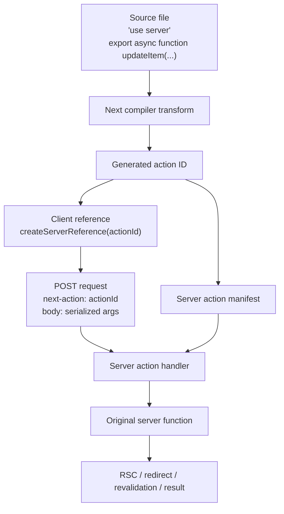

A few details are worth calling out:

- the client does not ship the original server function
- the client ships a reference to a generated action ID
- the browser invokes that ID with a `POST`
- the server uses a manifest to route the ID back to the original function
- the function arguments and return value must fit the serialization rules

This is why Server Actions can feel like magic. The framework created a small RPC layer for you.

It is also why they need to be treated with the same care as any other RPC layer.

## The Action ID Is Not A Contract

The generated action ID is not a stable API name like `/api/update-item`.

At build time, the framework needs to decide which server function an ID points to. The inputs to that ID have changed across framework versions and can include implementation details such as a build salt, file path, export name, and function-shape information.

That means a small code or framework change can produce a different ID for the same conceptual mutation.

Here is the part I think is easy to miss.

In one version of the scheme, the action ID was effectively tied to a small set of build-time facts:

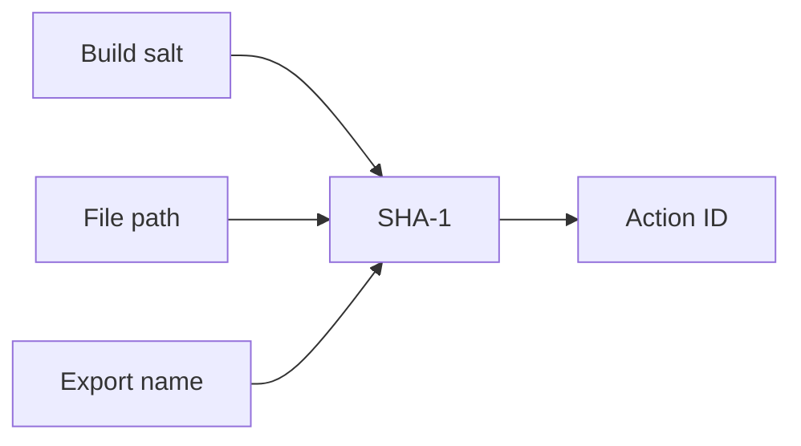

In that world, this kind of refactor could keep the same action ID:

```ts
'use server'

export async function updateItem(id: string, value: string) {
  // ...
}
```

```ts
'use server'

export async function updateItem(
  id: string,
  value: string,
  options?: { optimistic?: boolean },
) {
  // ...
}
```

The file stayed the same. The export stayed the same. If the build salt stayed the same, the action ID stayed the same.

Newer implementations include more function-shape information. In the current Next source, the generated server reference ID still starts from a SHA-1 over the hash salt, file name, and export name, but it also appends a byte that encodes whether the reference is a cache reference plus an argument mask and rest-argument bit.

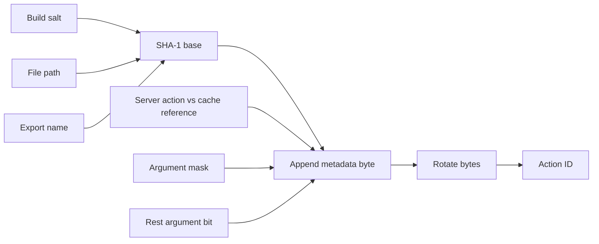

That is a reasonable implementation change. The framework is trying to encode more about the server reference into the ID. But operationally, it changes the compatibility story. A parameter-shape change can now mean "new generated API endpoint," even if the source file and export name did not move.

The difference looks roughly like this:

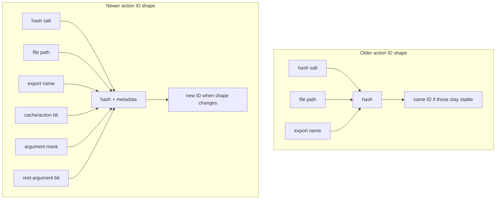

This is the kind of detail that disappears inside an upgrade. The source diff looks like a compiler implementation detail. In production, it can change the public token old clients use to call the server.

Another way to say it: the public "API name" is synthesized from code shape.

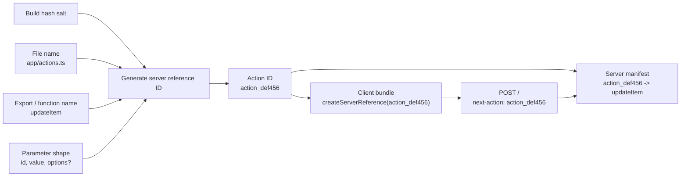

That is the surprising part. The thing behaving like an API route is not named by a URL you wrote. It is named by a compiler-generated ID derived from implementation details.

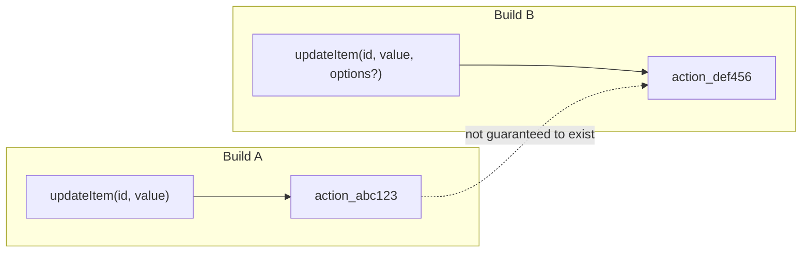

Most of the time this is fine. A fresh page load gets the fresh JavaScript bundle, which contains fresh action IDs, and it talks to a matching server.

The trouble starts during deploys.

## The Rolling Deploy Problem

Imagine a user has an old page open. The page was rendered by Build A, and the JavaScript bundle contains `action_abc123`.

While the tab is open, Build B rolls out. Build B only knows about `action_def456`.

Then the user clicks Save.

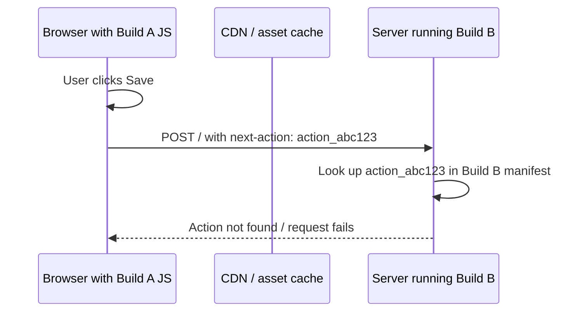

From the user's point of view, nothing unusual happened. They opened a page and clicked a button.

From the server's point of view, a client called an action ID that no longer exists.

That kind of failure is easy to miss locally. Local development usually has one browser, one server, one version, and no real deploy overlap. Production has cached assets, long-lived tabs, rolling deploys, multiple instances, retries, and users who click buttons at inconvenient times.

When this fails during a deploy, the graph does not look like a slow burn. It looks like a cliff:

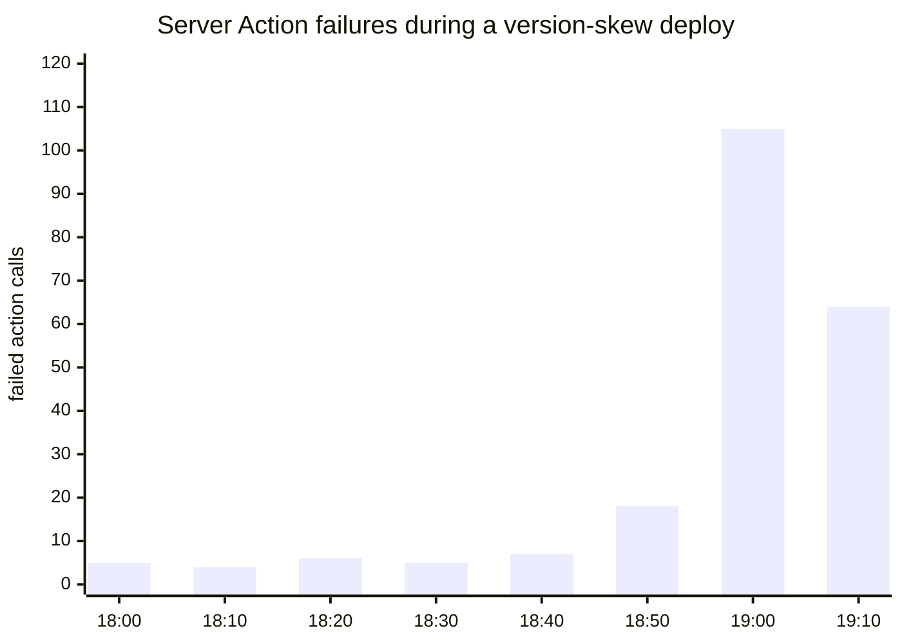

The shape is the clue. A normal app bug usually follows traffic. Action ID skew shows up when the deploy crosses the old-client/new-server boundary.

## Why This Is Different From A Route Handler

An explicit route can be versioned:

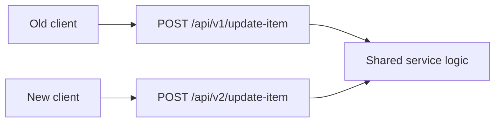

You can keep `v1` alive during migration. You can log usage. You can reject bad input with a typed error. You can publish a compatibility window. You can put the path in a runbook.

With Server Actions, the API surface is generated. That is the point. You get less boilerplate because you gave the framework control over the transport.

That tradeoff is fine for many UI-local mutations. It is much less comfortable for anything that needs a durable API boundary.

## Use Them, But Draw The Line

I would use Server Actions for:

- forms that are tightly coupled to one page
- low-risk UI mutations
- mutations where a full page refresh fallback is acceptable
- actions that only need to work within one deployed version
- code where colocating mutation logic with the route is worth the coupling

I would be careful using them for:

- mutations called from many routes or packages
- workflows that need schema versioning
- endpoints used by mobile apps, extensions, workers, or other services
- high-volume mutations that need independent rate limits and observability
- flows that must survive rolling deploys without old-client failures
- anything that already looks like a product API

The line is not "Server Actions are bad." The line is "Server Actions are not a replacement for every API."

## Deployment Safety

If you do use Server Actions heavily, treat deploy compatibility as part of the design.

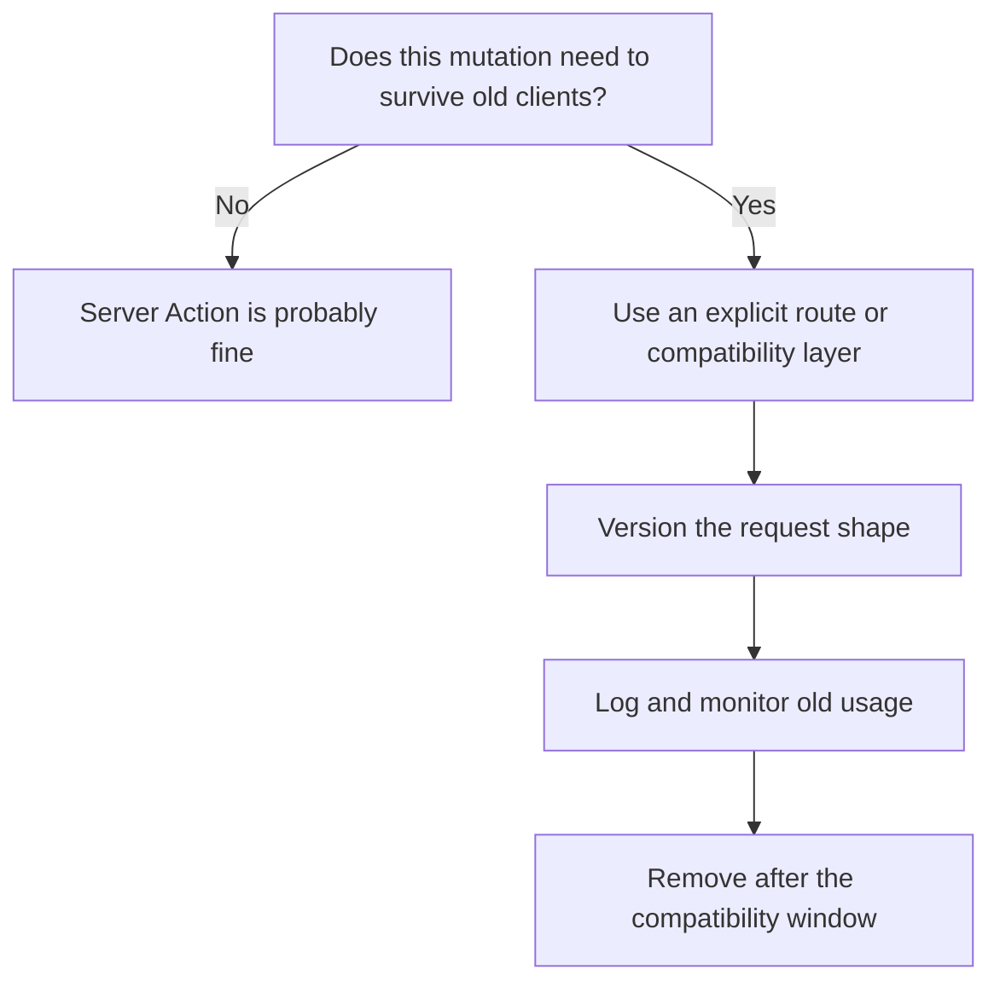

Practical mitigations include:

- keep old servers around long enough for old pages to age out
- avoid serving old HTML with new-only server manifests
- use immutable asset URLs so a page and its JavaScript agree
- make Server Action errors visible in monitoring
- design important mutations so retrying through an explicit endpoint is possible
- avoid changing action signatures casually during framework upgrades

Next also has a separate concern around encrypted closed-over variables. In self-hosted multi-server deployments, the [official data security guide](https://nextjs.org/docs/15/app/guides/data-security) calls out `NEXT_SERVER_ACTIONS_ENCRYPTION_KEY` for making encryption behavior consistent across instances. That is not the same thing as stable action IDs, but it comes from the same general place: Server Actions have build-time and deployment-time state. Treat that state deliberately.

## The Mental Model

The easiest mistake is to think `"use server"` means "this is just a function call."

It is not. It is a framework-managed network call.

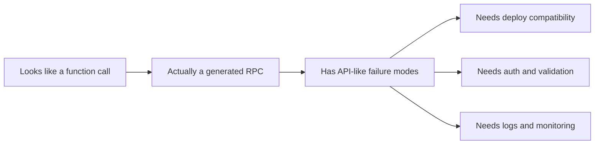

That does not make Server Actions useless. It makes them a sharp tool.

Use them where the ergonomics are worth the coupling. Reach for explicit Route Handlers or a BFF-style API when the boundary needs to be stable, observable, versioned, or shared outside one page.

The practical rule I use is:

> If breaking the generated action ID would look like an API outage, give it a real API.

## References

- [Next.js `use server` directive](https://nextjs.org/docs/app/api-reference/directives/use-server)
- [Next.js mutating data with Server Functions](https://nextjs.org/docs/app/getting-started/mutating-data)
- [Next.js data security guide](https://nextjs.org/docs/15/app/guides/data-security)
- [Next.js server action transform source](https://github.com/vercel/next.js/blob/canary/crates/next-custom-transforms/src/transforms/server_actions.rs)
- [Next.js action client wrapper source](https://github.com/vercel/next.js/blob/canary/packages/next/src/build/webpack/loaders/next-flight-loader/action-client-wrapper.ts)
